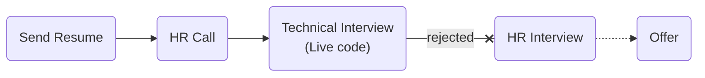

# [Malltina](https://malltina.com/)

### Status
#### 📜📞🔧❌

## Senior Software Engineer (python)

### Interview Process


### Apply Way
Jobinja

### Interview Date

- **Sent Resume**<br />1404.05.12

- **HR Call**<br />1404.05.21

- **Technical Interview**<br />1404.05.22

- **Response Email**<br /> not get any rejection Email

### Interview Duration
- **Technical Interview**<br />1 hour & 30 minutes

### Interview Platform
Google Meet

### Technical Interview
- Tell us about yourself.

#### Live code

Write a function to calculate `pow(x, n)`.
<details>
<summary style="font-size:14px"><b><em>Alireza answer</em></b></summary>
<div style="border:2px dashed #4a5568; padding:12px; border-radius:6px; margin-top:8px;  background-color: rgba(74,85,104,0.15);">

```python
def my_pow(x, n):
    if n < 0:
        return 1/recursive_pow(x, -1 * n)
    else:
        return recursive_pow(x, n)

def recursive_pow(x, n):
    if n == 0:
        return 1
    if n == 1:
        return x
    else:
        return x * recursive_pow(x, n-1)

```
</div>
</details>

### Score
<h4><mark style="background-color:#ffd700">6/10</mark></h4>
<p dir="rtl">
اوکی بود خیلی نظر خاصی ندارم. مقداری عجیب بود چنین شرکت نه چندان شناخته‌شده‌ای لایوکد داشته باشه. روند مصاحبه هم معرفی بود و حل مسئله. ایمیل ریجکتی هم ندادند.
</p>
